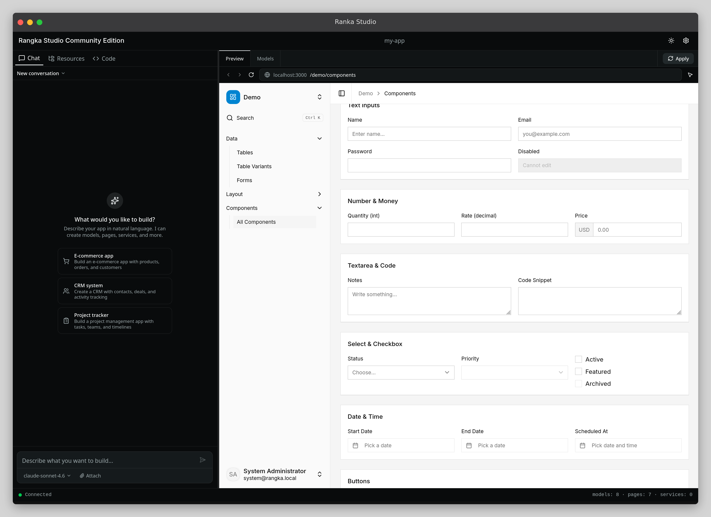

<p align="center">
  <a href="./docs/introduction.md">Documentation</a> ·
  <a href="./docs/concepts/how-it-works.md">How it works</a> ·
  <a href="./docs/contributing/development.md">Contributing</a>
</p>

> **This project is in alpha.** It is not production ready. APIs will change without notice. We welcome feedback, bug reports, and ideas through GitHub issues.

[](./LICENSE)
[](https://www.typescriptlang.org/)
[](https://nodejs.org/)

A TypeScript framework for building internal tools and business applications. Comes with native AI app builder



## Getting started

```bash
npx create-rangka my-app
cd my-app
npx rangka studio
```

This creates a new project and opens the studio in your browser. The studio is an AI agent that builds your app by writing models, pages, hooks, and services into your codebase. Everything it writes is standard framework code you can edit by hand.

## What the framework does

You write definitions. The framework interprets them at runtime into a working application. No scaffolding, no code generation step, no boilerplate.

From a single model definition you get:

- A database table with typed columns and relationships
- REST endpoints with filtering, sorting, and pagination
- A form with inputs matched to field types
- A list view with search and column sorting
- Permission checks at model, field, and row level
- Validation from field constraints

```typescript
import { defineModel, field } from 'rangka';

export default defineModel('sales.customer', {
  fields: {
    name: field.string({ required: true }),
    email: field.string(),
    status: field.enum(['active', 'inactive']),
    credit_limit: field.money(),
    assigned_to: field.link('core.user'),
  },
});
```

```typescript
import { definePage, widget } from 'rangka';

export default definePage({
  key: 'sales.customers',
  label: 'Customers',
  widgets: [
    widget.table('sales.customer', { sortable: true }, [
      widget.column('name', { label: 'Name', sortable: true, filterable: true }),
      widget.column('email', { label: 'Email', sortable: true }),
    ]),
  ],
});
```

That gives you a running app. Change a field, restart, and the database updates automatically. Non-destructive. Never drops data in development.

## Four definitions

Your entire application is built from four things:

| Definition      | What it does                                                                                   |
| --------------- | ---------------------------------------------------------------------------------------------- |
| `defineModel`   | Data shape. Fields, relationships, traits, computed values. Produces table, API, and UI.       |
| `definePage`    | A screen. Composes widgets into layouts, binds them to data, wires up actions.                 |
| `defineService` | Business logic. Pricing calculations, state transitions, integrations. Callable from anywhere. |
| `defineHooks`   | Lifecycle insertion points. Validate, enrich, trigger side effects on create/update/delete.    |

Everything else (jobs, permissions, modules, custom widgets) builds on top of these.

## Project structure

```
my-app/
├── rangka.config.ts
└── modules/
    └── sales/
        ├── module.ts
        ├── models/
        ├── pages/
        ├── hooks/
        └── services/
```

Files are discovered by convention. No manual registration. Drop a model file in `models/` and it exists at next restart.

## How it compares

### vs Retool, Appsmith

Those are hosted platforms where you build inside their runtime. Rangka is a framework that runs on your server with your database. You own the code and can extend anything without hitting platform walls.

### vs Odoo, ERPNext

They solve the same problem but with Python and XML configs from a decade ago. Rangka gives you TypeScript, a code-first workflow, and a modern development experience.

### vs building from scratch

Every new project means wiring up tRPC, Drizzle, Zod, and a React admin panel from zero. Rangka handles the repetitive 80% so you only write the business logic that makes your app different.

## Documentation

- [Introduction](./docs/introduction.md)
- [How it works](./docs/concepts/how-it-works.md)
- [Project structure](./docs/concepts/project-structure.md)

**Concepts:** [Models](./docs/concepts/models.md) · [Pages](./docs/concepts/pages.md) · [Hooks](./docs/concepts/hooks.md) · [Services](./docs/concepts/services.md) · [Jobs](./docs/concepts/jobs.md) · [Permissions](./docs/concepts/permissions.md)

**Reference:** [defineModel](./docs/reference/define-model.md) · [definePage](./docs/reference/define-page.md) · [defineHooks](./docs/reference/define-hook.md) · [defineService](./docs/reference/define-service.md) · [defineJob](./docs/reference/define-job.md) · [defineRoles](./docs/reference/define-roles.md) · [Data API](./docs/reference/data-api.md)

## Status

Alpha. Under active development. APIs will change before 1.0.

## Contributing

See [contributing/development.md](./docs/contributing/development.md) for setup instructions.

## License

The framework packages (`shared`, `core`, `client`, `cli`, `rangka`) are [MIT](./LICENSE).

The studio packages (`studio-core`, `studio-local`) are [AGPL-3.0](./packages/studio-core/LICENSE).
